<!--
  YUNUS · PLAYER 1 · pixel profile README
  Type: Silkscreen (SIL OFL 1.1, see assets/Silkscreen-OFL.txt).
-->

<a href="https://yunus.digital"></a>

  &nbsp;
  &nbsp;
  


Hey, I’m Yunus. I build useful tools, games and playful interfaces, and share the code, demos and decisions behind them.


<a href="https://github.com/MohammediYunus/yunus-os"></a>

**[Yunus OS](https://github.com/MohammediYunus/yunus-os)** · my repositories, pull requests and tasks in one place, with a little assistant that can talk back. Try the browser demo without installing anything, then run it locally to connect your own workspace. Voice and model integrations are optional, and supported actions ask for approval.

[Try it in your browser](https://mohammediyunus.github.io/yunus-os/) · [Run locally](https://github.com/MohammediYunus/yunus-os#try-it) · [Watch the demo](https://github.com/MohammediYunus/yunus-os/releases/download/v0.1.0/yunus-os-community-1080p.mp4) · [Report a problem](https://github.com/MohammediYunus/yunus-os/issues)

<b>See the real interface</b>

 

<a href="https://github.com/MohammediYunus/dwago"></a>

**[dwago](https://github.com/MohammediYunus/dwago)** · explore a repository through its symbols, imports and git history. Ask questions, trace the impact of a change, and see how files connect in an interactive brain map. Answers point back to the code. The card shows example queries such as *how do we prevent double charging?*

[Explore the source](https://github.com/MohammediYunus/dwago) · [Read the setup guide](https://github.com/MohammediYunus/dwago#install)

<b>See the real brain map</b>

 

<a href="https://github.com/MohammediYunus/capture-check"></a>

**[capture-check](https://github.com/MohammediYunus/capture-check)** · a small tool I made while improving my game recordings. It checks source-frame timestamps for slow capture cadence and stalls, with CSV/JSONL input and clear timing reports. In the stall example the median stays at 16.67 ms, which is why the median alone can hide a stall.

[Try the examples](https://github.com/MohammediYunus/capture-check#quick-start) · [Collect timestamps on Mac](https://github.com/MohammediYunus/capture-check/tree/main/examples/macos-screencapturekit) · [Report a problem](https://github.com/MohammediYunus/capture-check/issues)


I’m also digging into bugs in other open-source tools. Each fix is a boss fight: when a pull request merges, its bug is defeated. Statuses are read from GitHub automatically.

<!-- live:missions:start -->
<a href="https://github.com/chestso/portty/pull/9"></a>
<a href="https://github.com/urfave/cli/pull/2460"></a>
<a href="https://github.com/CoplayDev/unity-mcp/pull/1448"></a>
<a href="https://github.com/mermaid-js/mermaid/pull/8400"></a>
<a href="https://github.com/transloadit/uppy/pull/6688"></a>
<a href="https://github.com/Zulko/moviepy/pull/2598#issuecomment-6039403205"></a>
<a href="https://github.com/sharkdp/bat/pull/4018#issuecomment-6063551504"></a>
<a href="https://github.com/charmbracelet/bubbles/pull/1032#issuecomment-6063310809"></a>
<a href="https://github.com/dequelabs/axe-core/pull/5457"></a>

**Live status** (from GitHub, refreshed every 6 hours): [Portty #9](https://github.com/chestso/portty/pull/9) merged · [urfave/cli #2460](https://github.com/urfave/cli/pull/2460) merged · [Unity MCP #1448](https://github.com/CoplayDev/unity-mcp/pull/1448) open, awaiting review · [Mermaid #8400](https://github.com/mermaid-js/mermaid/pull/8400) open, in review · [Uppy #6688](https://github.com/transloadit/uppy/pull/6688) open, awaiting review · [MoviePy #2598](https://github.com/Zulko/moviepy/pull/2598#issuecomment-6039403205) reviewed and reproduced · [Bat #4018](https://github.com/sharkdp/bat/pull/4018#issuecomment-6063551504) regression test adopted by the author · [Bubbles #1032](https://github.com/charmbracelet/bubbles/pull/1032#issuecomment-6063310809) regression test adopted by the author · [axe-core #5457](https://github.com/dequelabs/axe-core/pull/5457) open, awaiting review

<!-- live:missions:end -->


<a href="https://x.com/MohammediYunus_/status/2107565252305174710"></a>

**Dwago: Journey to Hushfall** · a cozy adventure I’m building with satisfying combat, boss fights and a world full of secrets. I’m sharing gameplay clips as it takes shape.

[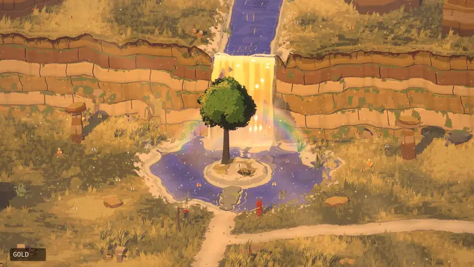](https://x.com/MohammediYunus_/status/2107565252305174710)

[Watch the gameplay trailer](https://x.com/MohammediYunus_/status/2107565252305174710) · [Download the full-quality 1080p60 video](https://github.com/MohammediYunus/MohammediYunus/releases/download/dwago-demo-2026-10-08/dwago-gameplay-1080p60.mp4)

This is a separate project from the dwago codebase tool above.



Python (dwago, capture-check) · JavaScript and Node.js (Yunus OS) · TypeScript and Next.js · Go (urfave/cli fix) · Rust (pinray fix) · C# and Unity (my game, Unity MCP fixes) · Swift · tree-sitter · MCP · GitHub Actions · AWS and Azure · Claude (build partner) · Ollama and Whisper (optional Yunus OS providers)


<a href="https://github.com/pulls?q=author%3AMohammediYunus+is%3Apublic+sort%3Aupdated-desc"></a>


Trying one of these tools? I’d love to hear what works and what gets in your way. <a href="https://x.com/MohammediYunus_">Find me on X</a> or open an issue in the project.

